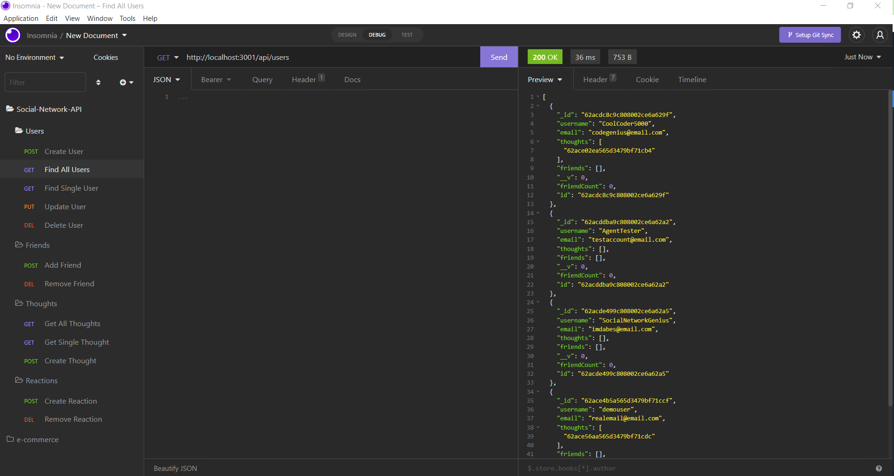

# social-network-api

## Description
The social-network-api is a simple CRUD application that designed for a social media site. The application includes CRUD routes for user, thoughts, and reactions to the thoughts. There is also the ability to add friends to the users. The application uses MONGODB and there is no front end connected to this project yet. You can access the functionality with Insomnia. 

## Walkthrough Video
https://youtu.be/ni5wVlhjqHg

## Table of Contents
- [Installation](#installation)
- [Contribution](#contribution)
- [License](#license)
- [Contact](#contact)

## Installation
Run "npm i" in the terminal to install the required packages. After the packages are installed you can run "node index.js" to start the server on localhost3001. Once the server is up and running you can navigate to Insomnia to see the functionality of the routes. For a more in depth walkthrough please refer to the video link posted towards the top of this README.  

## Contribution
All coding provided by Jeff Hicks. 

## License
This project is licensed with MIT License. 

## Contact
- Author: Jeff Hicks
- Email: hicks.jeff@me.com
- Github: https://github.com/jixxin